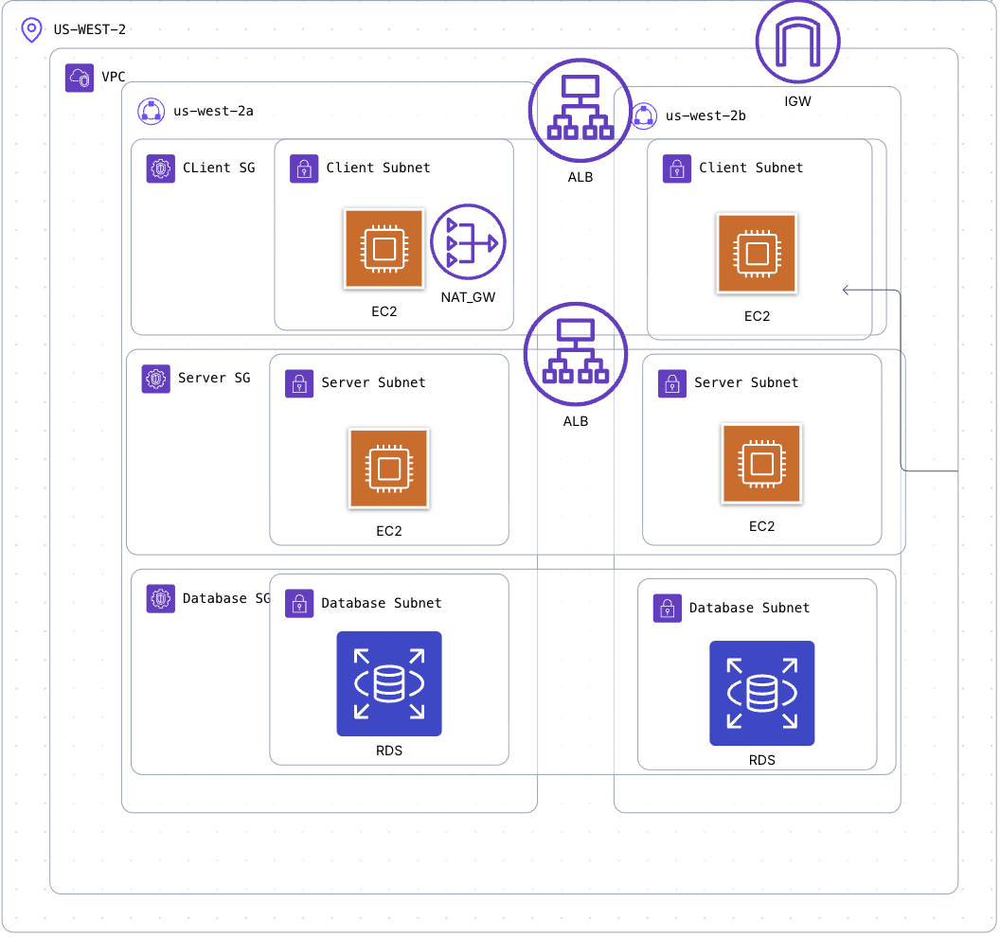

# HA-3TIER-WEBAPP
This repository contains Terraform infrastructure code for a highly available 3 tier web application, deployed on AWS.
# Overview 👀
<div align="center">
  
  <br><br>
</div>
This infrastructure code deploys the 3 tiers typically seen in modern production web applications:

  - **Client Tier** (Frontend)
  - **Server Tier** (Backend)
  - **Database Tier** (Database)

## Overarching
All three tiers are deployed on AWS.

They all preside witin an AWS Region, US West 2 has been arbitrarily chosen and can be easily changed.

Furthermore each tier has multiple availability zones. By default 2 has been assigned for dev/development environments and 3 for prod/production environments. This however can be changed.

All three tiers are deployed/contained within a VPC or Virtual Private Cloud, with an IGW or Internet Gateway Attached to it.


## Client Tier
The client tier contains the following:
  - **A Public Subnet**
  - **A Load Balancer**
  - **A Security Group**
  - **An EC2 Autoscaling Group - with Amazon Linux 2 EC2 Image**
  - **A NAT Gateway**

The EC2 Image can be changed/adapted as needed.

## Server Tier
The server tier contains the following:
  - **A Private Subnet**
  - **A Load Balancer**
  - **A Security Group**
  - **An EC2 Autoscaling Group - with Amazon Linux 2 EC2 Image**

The EC2 Image can be changed/adapted as needed.

## Database Tier
The database tier contains the following:
  - **A Private Subnet**
  - **A Security Group**
  - **An RDS Instance - with mysql engine**

The RDS Engine can be changed/adapted as needed.

## DeepDive
For a deep dive on this architecture, please feel free to read [this](https://medium.com/@samiur1998/designing-a-highly-available-3-tier-web-app-on-aws-40c1af63760f) article.

# Pre-requistites 📝
The following are pre-requistes that are necessary to successfully use this package and deploy the desired infrastructure:
  - [**A GitHub Account**](https://docs.github.com/en/get-started/start-your-journey/creating-an-account-on-github)
  - [**An AWS Account**](https://docs.aws.amazon.com/accounts/latest/reference/manage-acct-creating.html)
  - [**AWS CLI**](https://docs.aws.amazon.com/cli/latest/userguide/cli-chap-getting-started.html)
  - [**Terraform**](https://developer.hashicorp.com/terraform/install)
  - [**Terraform CLI**](https://developer.hashicorp.com/terraform/tutorials/aws-get-started/install-cli)

# Usage 🛠️
## Environment
This project has two different environment configurations:
  - **Dev (Development)**
  - **Prod (Production)**

As the name suggests the **Dev** environment is suitable for development and demoing purposes.

It has configurations and options that are AWS Free-Tier friendly and will not cost the user a dime. However, it cannot and should not be used for an actual production setup.
Importantly though it can have a huge impact where development, learning and creating proof of concepts/mvps are the primary objectives.

Prod is a bare-bones implementation of a 3tier web application in production. Self admitedly it is not perfect and will need tweaking/adjustments to be used in a production setup to the highest standard. 

These adjustments can vary wildly and will be extremly both organizational and use case specfic. Users will find **prod** as a perfect base from which they can quickly tweak and ramp up a production ready setup to meet their business use case.

Users that adopt this codebase then are encouraged to use both dev and prod in the following ways:
   - **Dev**: Day to day development and/or demoing
   - **Prod**: Actual infrasturcture used in production to serve customers


Be warned the **prod** setup is **NOT AWS Free Tier Friendly** and will incur costs. I assume no liability and encourage users to proceed at their own risk.

Lastly in order to change environments, simply change the `environment` variable in **variables.tf** file.

`dev` is the default and can be changed to `prod`
## AWS EC2 Key
EC2 instances are launched in private subnets for security. You can't connect directly from the internet.
A key pair provides the standard way to:

  - SSH into instances (e.g., `ssh -i my-key.pem ec2-user@instance-ip`)
  - Perform initial configuration, install software, check logs, or fix issues when automation isn't sufficient
  - Access instances via a bastion host / jump server (if your architecture includes one in a public subnet)

Please perform the following in order to generate an EC2 Key Pair:

```
# On your local machine
ssh-keygen -t ed25519 -f YOUR_KEY_PATH -C "YOUR_KEY_NAME"
chmod 400 YOUR_KEY_PATH
```

Afterwards add a **terrafrom.tfvars** file in the root directory and add the following code:

```
key_name = "YOUR_KEY_NAME"
key_path = "YOUR_KEY_PATH"
```

For more information on **ssh-key-gen** please refer to [this](https://docs.aws.amazon.com/AWSEC2/latest/UserGuide/ec2-key-pairs.html) article and for more information on the usage of **terraform.tfvars** files, please refer to [this](https://developer.hashicorp.com/terraform/language/values/variables) article.

## Deployment
First clone the repository to a local machine

`git clone https://github.com/shahLLL/ha-3tier-webapp.git`

Then run the following in order:

`terraform init`

In order to initialize the working directory

`terraform plan`

In order to get a preview of the changes that are going to be made

`terraform apply`

In order to perform the changes and deploy the desired infrasturcture in your AWS Account

## Destruction
It is always a good idea to clean/remove your infrasturcture once it is not being used. Please run the following in order to do so:

`terraform destroy`

# Forking & Contribution 🍴
Users are more than welcome to both fork this repo and use the code here. This can be to make a contribution to this codebase or for a users own external purposes.

However please do take note of the following:
[**LICENSE**](https://github.com/shahLLL/ha-3tier-webapp?tab=Apache-2.0-1-ov-file)

☕☕☕**CHEERS AND THANK YOU**☕☕☕
